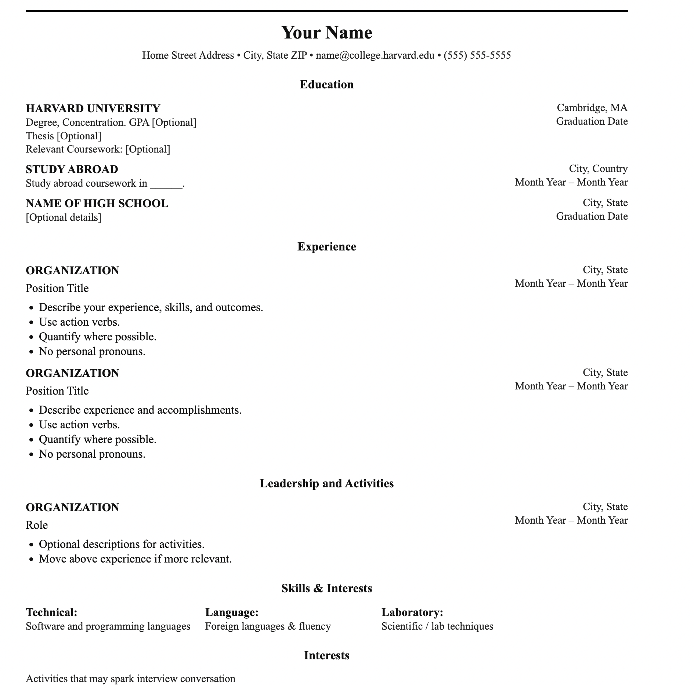

# Frontend Technical Specification

- Create a static website that serves an html resume. 

## Resume Format Considerations 

- The resume in word/pdf format is suppose to exclude information such as Age, Relationship, etc. 
- I'm going to use the [Harvard resume template Format](https://docs.google.com/document/d/1rK2prBm6ga4EGdlbNZ66NS0_KBLrOCSf/edit) as a basis of my resume. 


### Harvard Resume Format Generation 

I will let GenIA do the heavy lifting since i am very comfortable working with HTML and generate out the HTML and possibly CSS and then from there i will manually refactor the code to my prefered statndard. 

Prompt to ChatGPT 5: 
```text
Convert this resume format to HTML. 
Do not use a CSS framework. 
Use the least amount of CSS tags. 
```

Image provided to LLM


This is the [generated output](./docs/Nov-24-2025-resume_template.html) which i will refactor. 

This is the generated HTML looks like unaltered. 



## HTML Adjustments 

- UTF8 will support most languages. I plan to use English and Español so we will use this meta tag in out HTML. 
- We will include the below viewport meta tag since we are planning to apply mobile devcie stayling :-
```html
<meta name="viewport" content="width=device-width,initial-scale=1"/>
``` 
- We'll extract our styles into its own style sheet after we are happy with our HTML markup. 
- We'll simplify our HTML CSS selector to be as minimal as possible. 
- For the HTML page, i will use soft tabs and 2 spaces. 


